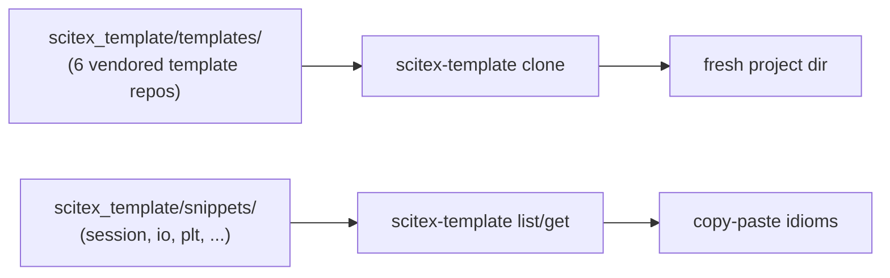

# scitex-template

<!-- scitex-badges:start -->
<p align="center">
  <a href="https://pypi.org/project/scitex-template/"></a>
  <a href="https://pypi.org/project/scitex-template/"></a>
  <a href="https://github.com/ywatanabe1989/scitex-template/actions/workflows/rtd-sphinx-build-on-ubuntu-latest.yml"></a>
</p>
<p align="center">
  <a href="https://github.com/ywatanabe1989/scitex-template/actions/workflows/pytest-matrix-on-ubuntu-py3-11-3-12-3-13.yml"></a>
  <a href="https://github.com/ywatanabe1989/scitex-template/actions/workflows/scitex-dev-quality-audit-on-ubuntu-latest.yml"></a>
  <a href="https://codecov.io/gh/ywatanabe1989/scitex-template"></a>
  <a href="https://www.gnu.org/licenses/agpl-3.0"></a>
</p>
<!-- scitex-badges:end -->

<p align="center">
  <a href="https://scitex.ai">
    
  </a>
</p>

<p align="center">
  <code>uv pip install scitex-template[all]</code> · <code>pip install scitex[template]</code>
</p>

---

## Problem and Solution

| # | Problem | Solution |
|---|---------|----------|
| 1 | **Six template repos evolving independently** — minimal scitex-* package, research project, cloud-module plugin, pip project, LaTeX manuscript, singularity container | **One vendored monorepo + cloner** — `pip install scitex-template` ships every `clone_*` function, plus a code-snippet library for scitex idioms (session decorator, io save/load, plt subplots) |
| 2 | **Cloner code buried in `scitex-python`** — release cadence didn't match the templates' | **Standalone cloner** — independent versioning, lazy umbrella imports, MCP server that exposes the same ops to agents |

## Installation

```bash
pip install scitex-template              # core (lazy imports for scitex.git / scitex.logging / scitex.scholar)
pip install scitex-template[mcp]         # MCP server deps (fastmcp)
pip install scitex-template[dev]         # pytest + coverage
```

The umbrella route also works — `pip install scitex[template]` pulls this package transitively.

## Demo

```bash
# Clone any of the 6 vendored templates into a fresh dir
scitex-template clone scitex-pkg my-new-pkg     # minimal scitex-* package
scitex-template clone research-project paper-2026
scitex-template clone latex-manuscript thesis
scitex-template clone singularity-container apptainer-rig

# List available templates + code snippets
scitex-template list-templates
scitex-template list-snippets
```



## Architecture

```
scitex_template/
├── templates/                ← 6 vendored template repos (kept in sync)
│   ├── scitex-pkg/           ← minimal scitex-* package skeleton
│   ├── research-project/     ← @stx.session-driven analysis layout
│   ├── cloud-module-plugin/  ← scitex-cloud plugin scaffold
│   ├── pip-project/          ← bare-bones PyPI package
│   ├── latex-manuscript/     ← scitex-writer-compatible paper
│   └── singularity/          ← apptainer container recipe
├── snippets/                 ← copy-paste idioms (session, io, plt, ...)
├── _cli/                     ← `scitex-template clone` / list / get
└── _mcp/                     ← MCP server exposing the same ops to agents
```

Each template ships as plain files; cloning is a recursive copy with
optional `{name}` substitution, no Cookiecutter-style runtime
templating engine. The MCP server re-exports the CLI surface 1:1.

## Quick Start

```bash
pip install scitex-template
scitex-template list-templates
scitex-template clone research ./my-experiment
```

```python
from scitex_template import clone_research, get_code_template

clone_research(target="my-experiment", project_name="my-experiment")
print(get_code_template("session"))
```

## 3 Interfaces

<details open>
<summary><strong>Python API</strong></summary>

<br>

```python
import scitex  # noqa: F401 — ensures scitex.git / .logging are importable

from scitex_template import (
    clone_research,
    clone_pip_project,
    clone_scitex_minimal,
    get_available_templates_info,
    get_code_template,
)

# Clone a research project template
clone_research(target="my-experiment", project_name="my-experiment")

# Discover available templates
for info in get_available_templates_info():
    print(f"{info['id']:>10}  {info['description']}")

# Pull a code snippet for a scitex session script
print(get_code_template("session"))
```

The legacy import path `from scitex.template import …` also still works via a compatibility shim in `scitex-python`.

</details>

<details>
<summary><strong>CLI</strong></summary>

<br>

Entry point: `scitex-template` (also `python -m scitex_template`).

```bash
scitex-template list-templates             # enumerate templates
scitex-template show-info research         # template metadata
scitex-template clone research ./my-proj   # populate from cache
scitex-template refresh-cache              # force re-clone
```

</details>

<details>
<summary><strong>MCP Server — for AI Agents</strong></summary>

<br>

Install with `pip install scitex-template[mcp]` and the package exposes
async handlers (`template_list`, `template_info`, `template_clone`,
`template_cache_refresh`) over MCP — agents can scaffold projects without
running Python themselves.

</details>

## Template repos

`scitex-template` clones from these external repositories:

| Template id | Repo |
|---|---|
| `research` | [scitex-research-template](https://github.com/ywatanabe1989/scitex-research-template) |
| `app` / `pip` | [pip-project-template](https://github.com/ywatanabe1989/pip-project-template) |
| `cloud-module` | [scitex-template-cloud-module](https://github.com/ywatanabe1989/scitex-template-cloud-module) |
| `minimal` | [scitex-minimal-template](https://github.com/ywatanabe1989/scitex-minimal-template) |
| `singularity` | [singularity_template](https://github.com/ywatanabe1989/singularity_template) |
| `paper` | [paper-template](https://github.com/ywatanabe1989/paper-template) |

A future revision may vendor these as `templates/<id>/` subdirs in this repo so the cloner and the templates ship in lockstep.

## Dependency notes

Per the SciTeX downstream dependency rule (general/01_arch_02), this package aims to avoid a hard runtime dep on the `scitex` umbrella. At present three submodules are still imported lazily inside `clone_*` functions: `scitex.git`, `scitex.logging`, `scitex.scholar.ensure_workspace`. Once `scitex-git` is extracted as a standalone, those imports will move to the standalone equivalents (`scitex_git`, `scitex_logging`, `scitex_scholar`). Users running `pip install scitex[template]` pick up the umbrella transitively, so there is no current breakage.

## License

AGPL-3.0-only.

## Part of SciTeX

`scitex-template` is part of [**SciTeX**](https://scitex.ai). Install via
the umbrella with `pip install scitex[template]` to use as
`scitex.template` (Python) or `scitex template ...` (CLI).

> Four Freedoms for Research
>
> 0. The freedom to **run** your research anywhere — your machine, your terms.
> 1. The freedom to **study** how every step works — from raw data to final manuscript.
> 2. The freedom to **redistribute** your workflows, not just your papers.
> 3. The freedom to **modify** any module and share improvements with the community.
>
> AGPL-3.0 — because we believe research infrastructure deserves the same freedoms as the software it runs on.

---

<p align="center">
  <a href="https://scitex.ai" target="_blank"></a>
</p>
