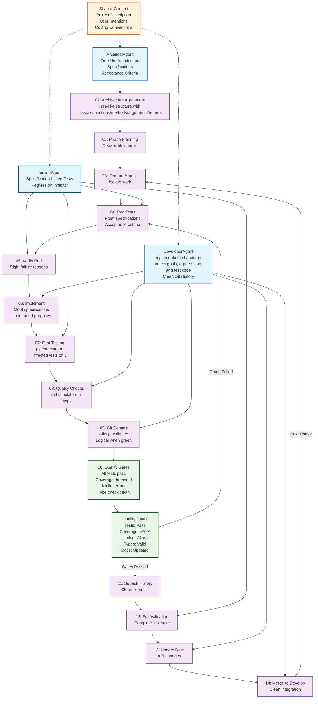

<!-- ---
!-- Timestamp: 2025-08-31 09:13:29
!-- Author: ywatanabe
!-- File: /home/ywatanabe/proj/pip-project-template/README.md
!-- --- -->


NOTE THAT THIS IS AN EXAMPLE BOILERPLATE FILE CREATED IN PIP PROJECT TEMPLATE PROJECT. PLEASE REMOVE OR UPDATE TO FIT YOUR PROJECT.

## Usage as a Boilerplate Template

### 1. Clone and Setup Your New Project

```bash
# Clone the template to your new project directory
git clone https://github.com:ywatanabe1989/pip-project-template YOUR-PACKAGE-NAME && cd YOUR-PROJECT-NAME

# Remove the existing git history and start fresh
# rm -rf .git # Run this carefully after checking current directory is YOUR_PROJECT_ROOT
git init
git add .
git commit -m "Initial commit from pip-project-template"
```

### 2. Customize for Your Project

```bash
# Use the automated rename script to update package names throughout the project
# (Preview changes first with dry-run mode)
./mgmt/utils/rename.sh pip-project-template YOUR-PACKAGE-NAME    # Preview hyphenated names
./mgmt/utils/rename.sh pip_project_template YOUR_PACKAGE_NAME    # Preview underscore names

# Apply the changes (add -n flag to execute)
./mgmt/utils/rename.sh pip-project-template YOUR-PACKAGE-NAME -n
./mgmt/utils/rename.sh pip_project_template YOUR_PACKAGE_NAME -n

# Update project metadata in pyproject.toml
# - Update description, author, email, and URLs  
# - Modify dependencies as needed
# - Update repository URLs and classifiers

# Remove or update boilerplate notices in all files:
# - Python files: Remove "NOTE THAT THIS IS AN EXAMPLE BOILERPLATE..." comments
# - Config files: Update _description fields
# - Documentation: Replace with your project's actual content
```

### 3. Initialize Your Development Environment

```bash
# Create virtual environment
python -m venv .env
source .env/bin/activate  # On Windows: .env\Scripts\activate

# Install in development mode
make install

# Run tests to verify everything works
make test-full
```

### 4. Start Developing Your Project

```bash
# Remove example code and replace with your functionality:
# - Update Calculator class in core/ with your business logic
# - Replace utility functions in utils/ 
# - Modify CLI commands in cli/
# - Update MCP servers in mcp_servers/ or remove if not needed
# - Replace data types in types/

# Update documentation
# - Edit this README.md with your project details
# - Update examples/ notebooks with your use cases
# - Modify mgmt/ files with your project architecture
```

# Pip Project Template as a boilerplate

A Python project template for a pip package, featuring **FastMCP 2.0** servers. Agentic workflows (Planning + Test-Driven Development) is also implemented.

[](https://github.com/ywatanabe1989/pip-project-template/actions)
[](https://www.python.org/downloads/)
[](https://gofastmcp.com)

## Agentic Coding Workflow

<details>
<summary>Diagram</summary>



</details>

## Quick Start (Template Examples)

The [Makefile](./Makefile) provides convenient commands for development. After customizing for your project:

```bash
# Development Setup
make install          # Install in development mode with dependencies
make test-full        # Run complete test suite with coverage
make test-changed     # Run only tests affected by code changes (fast)
make lint             # Run code formatting and linting

# Quality Assurance  
make coverage-html    # Generate HTML coverage reports
make ci-local         # Run local CI validation
make ci-container     # Test with containers (Apptainer/Docker)
make ci-act           # Run GitHub Actions locally

# Distribution
make build            # Build wheel and sdist for distribution
make upload-pypi-test # Upload to Test PyPI for validation
make upload-pypi      # Upload to production PyPI
make release          # Complete release: clean, build, upload

# Maintenance
make clean            # Remove build artifacts and cache files
```

## Example CLI Commands

The template includes sample CLI commands (replace with your own after customization):

```bash
# Calculator examples (template functionality)
python -m pip_project_template calculate 10 5 --operation add
python -m pip_project_template calculate 8 3 --operation multiply

# MCP server examples  
python -m pip_project_template serve01 --transport stdio
python -m pip_project_template serve02 --port 8082 --transport http

# Information display
python -m pip_project_template info
```

## MCP Servers
<details>
<summary>JSON Config</summary>

``` json
{
  "mcpServers": {
    "calculator-basic": {
      "command": "python",
      "args": ["-m", "pip_project_template", "serve01", "--transport", "stdio"],
      "env": {
        "PYTHONPATH": "."
      }
    },
    "calculator-enhanced": {
      "command": "python", 
      "args": ["-m", "pip_project_template", "serve02", "--transport", "stdio"],
      "env": {
        "PYTHONPATH": "."
      }
    },
    "http-calculator": {
      "url": "http://localhost:8081/mcp",
      "transport": "http"
    },
    "sse-calculator": {
      "url": "http://localhost:8082",
      "transport": "sse"
    }
  },
  "defaults": {
    "timeout": 30,
    "retries": 3
  },
  "logging": {
    "level": "INFO",
    "file": "logs/mcp.log"
  }
}
```

</details>

## Project Structure

```
src/pip_project_template/   # Main package source code (rename after customization)
├── cli/                    # Command-line interface modules
├── core/                   # Core business logic  
├── mcp_servers/            # FastMCP server implementations
├── types/                  # Data types and containers
└── utils/                  # Utility functions

tests/                      # Test suite
├── custom/                 # Custom integration tests
├── pip_project_template/   # Unit tests (mirrors src structure)
└── reports/                # Test coverage and results

config/                     # Configuration files
├── mcp_config.json         # MCP server configuration

mgmt/                       # Project management
├── utils/                  # Management utilities (rename.sh, etc.)
└── *.org                   # Architecture and project documentation

data/                       # Persistent data storage
examples/                   # Usage examples and tutorials (Jupyter notebooks)
```

## Test results

<details>
<summary>MCP servers can be also tested.</summary>

```
# $ make coverage-html
# $ date # Wed Aug 27 11:33:31 AM AEST 2025

================================================== tests coverage ===================================================________________________________ coverage: platform linux, python 3.11.0-candidate-1 ________________________________
Name                                                    Stmts   Miss    Cover   Missing
---------------------------------------------------------------------------------------
src/pip_project_template/__main__.py                        9      0  100.00%
src/pip_project_template/cli/_GlobalArgumentParser.py      38      0  100.00%
src/pip_project_template/cli/calculate.py                  20      0  100.00%
src/pip_project_template/cli/info.py                       37      0  100.00%
src/pip_project_template/cli/serve01.py                    27      0  100.00%
src/pip_project_template/cli/serve02.py                    27      0  100.00%
src/pip_project_template/core/_Calculator.py               19      0  100.00%
src/pip_project_template/mcp_servers/McpServer01.py        46      0  100.00%
src/pip_project_template/mcp_servers/McpServer02.py        52      0  100.00%
src/pip_project_template/types/_DataContainer.py           18      0  100.00%
src/pip_project_template/utils/_add.py                     11      0  100.00%
src/pip_project_template/utils/_multiply.py                11      0  100.00%
---------------------------------------------------------------------------------------
TOTAL                                                     315      0  100.00%
Coverage HTML written to dir tests/reports/htmlcov
Coverage JSON written to file tests/reports/coverage.json
Required test coverage of 100% reached. Total coverage: 100.00%
============================================== short test summary info ==============================================FAILED tests/pip_project_template/cli/test__GlobalArgumentParser.py::TestCentralargumentparser::test_get_command_parsers_exception_handling - AssertionError: assert 'good-module' in {}
FAILED tests/pip_project_template/core/test_core_init.py::TestInit::test_functional_implementation_placeholder - NotImplementedError: Functional tests for pip_project_template.core.__init__ are not implemented yet. Please imp...
FAILED tests/pip_project_template/test_package_init.py::TestInit::test_functional_implementation_placeholder - NotImplementedError: Functional tests for pip_project_template.__init__ are not implemented yet. Please implemen...
==================================== 3 failed, 158 passed, 90 warnings in 28.69s ====================================make: *** [Makefile:34: coverage-html] Error 1
(.env-3.11) (wsl) pip-project-template $ 
```

</details>

## Requirements

Python 3.11+

## License

MIT

## Contact
Yusuke.Watanabe@scitex.ai

<!-- EOF -->